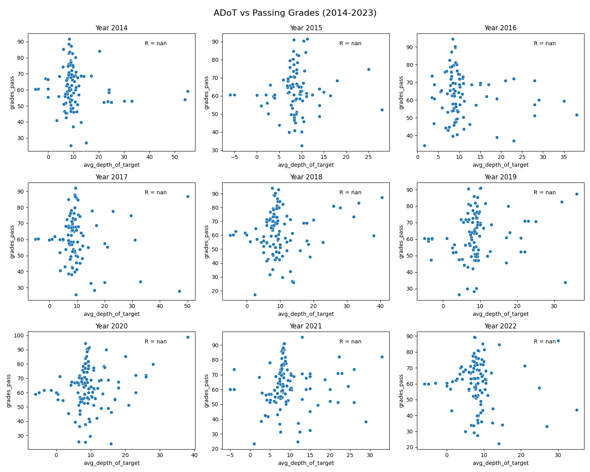

# QB Performance Analysis: ADoT vs Passing Grades (2014-2023)

## Overview
This project analyzes the performance of NFL quarterbacks over the past decade (2014-2023) using **Average Depth of Target (ADoT)** and **Passing Grades** from PFF (Pro Football Focus). The scatter plots visualize the relationship between how far quarterbacks throw on average and their overall performance as graded by PFF.

## Key Features
- **Data Source**: The data was collected from passing summary files from 2014 to 2023 in Pro Football Focus database.
- **Analysis**: The scatter plots show the relationship between ADoT and Passing Grades for each year, along with linear regression lines and R-values to indicate the strength of correlation.

## Insights
This analysis helps identify trends over the years:
- Are QBs with higher ADoT more effective in a particular year?
- How consistent is the relationship between ADoT and performance over time?
  
## Visualization
Below is the generated visualization that represents the **ADoT vs Passing Grades** for quarterbacks between 2014 and 2023:



## Setup Instructions
To run this analysis or generate similar visualizations:
1. Clone the repository:
   ```bash
   git clone https://github.com/Jacksonw0830/QB-Success
   cd QB-Success
