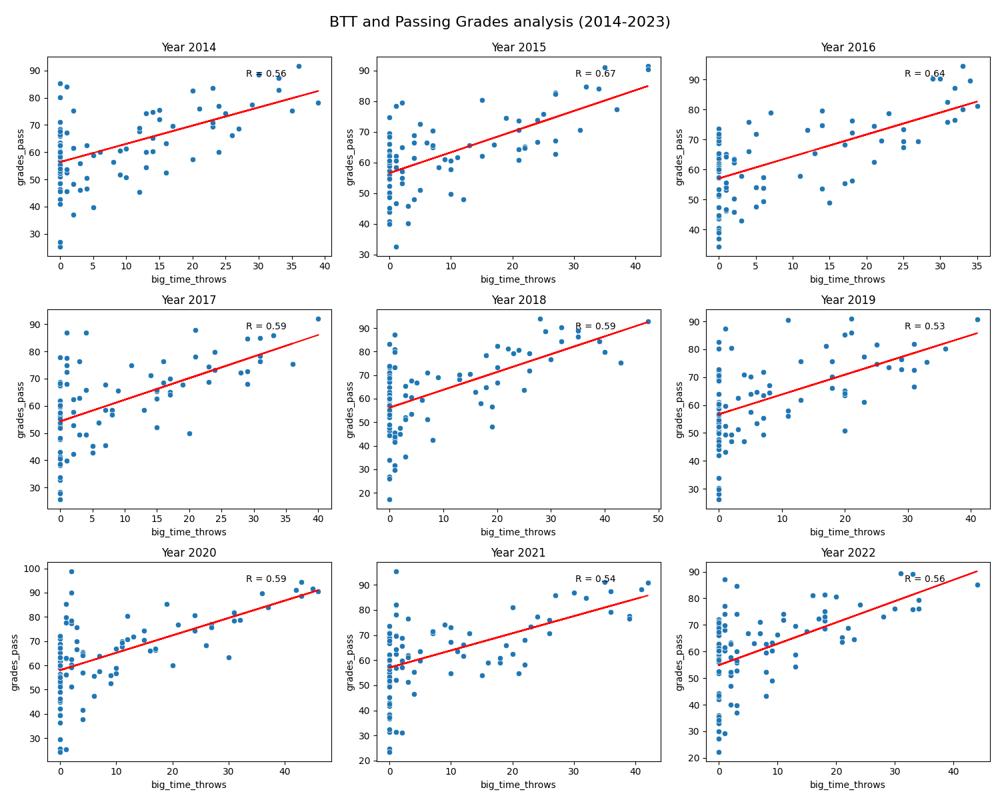

# QB Performance Analysis: Big-Time Throws (BTT) and Passing Grades (2014-2023)

## Overview
This project analyzes the performance of NFL quarterbacks over the past decade (2014-2023) using **Big Time Throw (BTT)** and **Passing Grades** from Pro Football Focus (PFF). The project integrates **Apache Kafka** (KRaft mode) and follows the **ETL** process to analyze the data and visualize trends.

## Insights

This analysis focuses on the relationship between **Big-Time Throws (BTT)** and **Passing Grades**. BTT measures a quarterback's ability to make difficult, high-value throws, which often result in better performance ratings.

The scatter plots below show how quarterbacks with more BTT correlate with higher passing grades across multiple seasons (2014-2023).

### Key Questions:
1. Are QBs with more Big-Time Throws (BTT) graded higher in a particular season?
2. How consistent is the relationship between BTT and Passing Grades across multiple years?

## Development Environment
This project was developed using **Windows Subsystem for Linux (WSL)** and **Python 3**. Follow the steps below to set up the environment:

1. **WSL**: You can install WSL on your Windows machine by following the instructions [here](https://docs.microsoft.com/en-us/windows/wsl/install).
2. **Python 3**: Ensure Python 3 is installed in your WSL environment. You can check the installation by running:
   ```bash
   python3 --version

If Python 3 is not installed, you can install it with:
	sudo apt update
	sudo apt install python3

## Apache Kafka KRaft Server Integration

This project uses Apache Kafka (KRaft mode) to stream NFL quarterback data and feed it into the ETL pipeline for analysis. Kafka allows for real-time data streaming, ensuring efficient data collection and processing.

Kafka Setup:
Kafka Server (KRaft mode): The project uses Kafka in KRaft mode for simplified deployment without the need for Zookeeper.  Kafka Topic: The topic used for this project is qb-performance.

Kafka Producer:
The producer sends NFL QB performance data to the Kafka topic qb-performance. Data is simulated or extracted and sent in real-time.

	kafka-console-producer.sh --topic qb-performance --bootstrap-server localhost:9092

The Kafka consumer listens for messages on the qb-performance topic. Here's the command to start the consumer:

	kafka-console-consumer.sh --topic qb-performance --from-beginning --bootstrap-server localhost:9092

## ETL Process

The ETL (Extraction, Transformation, and Loading) pipeline processes NFL QB performance data from Kafka and prepares it for analysis.

Extraction:
   The Kafka consumer extracts real-time data from the qb-performance topic.

Transformation:
   Data is cleaned and aggregated for analysis, with key metrics like Big Time Throw (BTT)  and Passing Grades being calculated.

Loading:
   The transformed data is loaded into a pandas DataFrame for visualization and further analysis.

# Extraction via Kafka consumer
consumer = KafkaConsumer('qb-performance', bootstrap_servers='localhost:9092')

for message in consumer:

    process_data(message.value)  # Process and transform data

# Transformation example
nfl_data = pd.read_csv('passing_summary(2022).csv')
transformed_data = nfl_data.groupby('year').agg({'big_time_throws': 'mean', 'grades_pass': 'mean'})

# Loading data for visualization
transformed_data.to_csv('transformed_data.csv')

## Visualization
Below is the visualization of  **BTT vs Passing Grades** for quarterbacks between 2014 and 2023:




## Setup Instructions

To run this analysis or generate similar visualizations:

1.  Clone the repository: 
	git clone https://github.com/Jacksonw0830/QB-Success
	cd QB-Success
2. pip3 install -r requirements.txt
3. Start the Kafka server (in KRaft mode):
	kafka-server-start.sh /path/to/kafka/config/kraft/server.properties
4. Create the Kafka topic:
	kafka-topics.sh --create --topic qb-performance --bootstrap-server localhost:9092 --partitions 1 --replication-factor 1
5. Start the Kafka producer to send data:
	kafka-console-producer.sh --topic qb-performance --bootstrap-server localhost:9092
6. Run the ETL pipeline:
	python3 scripts/etl_pipeline.py
